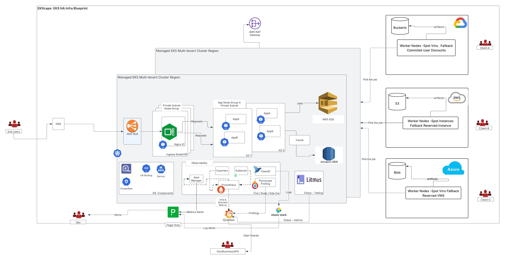

# eks-ha-infra-blueprint

> **A production-ready, high-availability EKS platform with CI/CD, observability, and alerting – all in one blueprint.**

---

## Overview

Naming my cluster as **Ekscape** , a blueprint for deploying a highly available Amazon EKS cluster. It my ongoig project which integrates modern DevOps tools and best practices to streamline infrastructure management and application delivery.

This project is perfect for engineers, teams, and platform architects looking to stand up a production-grade Kubernetes cluster with minimal friction on Amazon EKS.

## Architecture : 



---

## Features

- ⚙️ **High Availability (HA)**: Multi-AZ EKS setup with self-healing node groups
-  **CI/CD Integration**: GitOps-driven continuous delivery using ArgoCD
-      https://ac4c6ddce482f4bb59c81b0f0979729b-2113508635.us-east-2.elb.amazonaws.com/
- 📊 **Observability**: Full ELK stack (Elasticsearch, Logstash, Kibana) for logs and monitoring
- 🚨 **Alerting**: Integrated with PagerDuty for incident response
- 🔐 **Security Best Practices**: IAM roles, secrets management, and private networking
- 🌐 **Infrastructure as Code**: Fully automated cluster and platform provisioning
      - Terraform    

---

## 🗂️ Project Structure

```bash
.
├── IaC/                 # Terraform  for infra components
├── cd/                 # Argo CD configuration for deploying the apps 
├── observability/      # Metrics, Logs, Profiling Components 
├── k8apps/helm/        # helm charts for apps. 
├── scripts/                 # Utility and bootstrap scripts
├── README.md
└── LICENSE
